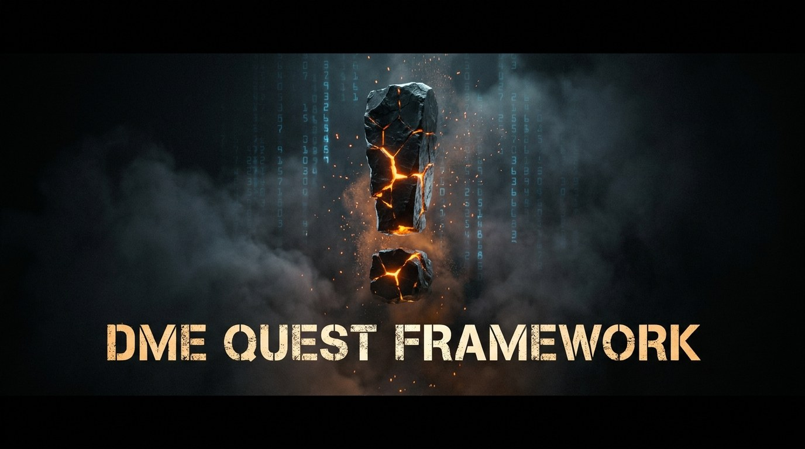

# DME Quest Framework

<p align="center">
  
</p>

<p align="center">
  
  
  
  <a href="LICENSE.md"></a>
</p>

<p align="center">
  
  
  
  
  
  
</p>

<p align="center">
  <b>A Tarkov-inspired quest &amp; task framework for DayZ</b><br>
  Traders with reputation and loyalty tiers, chained story quests, 19 objective types,
  <code>Found in World</code> item provenance, expeditions with extraction and deterministic
  daily/weekly tasks — fully JSON-driven, server-authoritative and persistent.
</p>

<p align="center">
  <a href="https://deadmansecho.com">
    
  </a>
  <a href="../../wiki">
    
  </a>
</p>

---

## Repository Layout

The framework ships as **four PBOs**. Core, Objectives and UI are mandatory; Integrations is optional.

```text
DME_Quest_Framework/
├── DME_Tasks_Core/           ← data models, config, RPC, quest engine, persistence,
│                               rewards                     (3_Game / 4_World / 5_Mission)
├── DME_Tasks_Objectives/     ← objective handlers, event hooks (kill / item / zone /
│                               craft / action), item origin              (4_World)
├── DME_Tasks_UI/             ← menu (F4), HUD tracker, dialogs, notifications,
│                               keybind                                   (5_Mission)
├── DME_Tasks_Integrations/   ← optional adapters (Market / AI / Boss / Groups /
│                               Terje / Season / Website)                 (4_World)
│
├── _ServerProfile_Example/   ← ready-to-copy $profile:DME_Tasks template
│                               (1 trader, quest chain west_001–west_006, 2 templates)
├── ACCEPTANCE_TESTS.md       ← acceptance checklist along the MVP quest chain
└── data/                     ← banner and documentation images
```

All gameplay content is authored in **JSON** under `$profile:DME_Tasks` — no script edits, no repack.

---

## Features

<table>
<tr>
<td width="33%" valign="top">

### Quests &amp; Progression

- Chained story quests
- Prerequisite gating: level, reputation, faction, decisions, items, time-of-day
- Player decisions that unlock **or block** whole questlines
- Deterministic daily/weekly generation (restart-stable)
- Repeatable quests with cooldowns
- Time limits, fail-on-death, fail-on-faction-change
- Unlock gating: quests, market items, keys, boss access

</td>
<td width="33%" valign="top">

### Objectives &amp; World

- **19 objective types**
- Cylindrical zone triggers
- Kill filters: class, category, boss id, distance, weapon, suppressor, hit zone, zone, time-of-day
- **Item origin metadata** — `Found in World` enforcement
- Expeditions with extraction + combat-logout fail
- Handover / deliver with partial turn-in
- Survive, defend, escort, group, craft

</td>
<td width="33%" valign="top">

### Traders &amp; Infrastructure

- Traders with reputation &amp; loyalty tiers
- Rival reputation — helping one hurts another
- Server-authoritative; the UI only sends request RPCs
- Idempotent rewards — no double-claim via RPC spam
- Atomic saves + rotating backups
- Coalescing flush, flush on disconnect
- Optional adapters, detected via `CfgPatches`
- Zero hard references to foreign mods

</td>
</tr>
</table>

### The 19 Objective Types

| | | | |
|---|---|---|---|
| `KILL` | `BOSS` | `COLLECT` | `HANDOVER` |
| `DELIVER` | `TRAVEL` | `DISCOVER` | `MARK` |
| `STASH` | `INTERACT` | `USE_ITEM` | `SIGNAL` |
| `SURVIVE` | `RETURN_TO_TRADER` | `CRAFT` | `ESCORT` |
| `DEFEND` | `GROUP` | `EXTRACT` | |

Each type has its own filter set — the full matrix is in the
[Objective Types](../../wiki/Objective-Types) wiki page.

---

## Quick Start

```text
1. Install Community Framework (CF)
2. Copy the DME_Tasks_* mods next to your server
3. Put the .bikey into the server's keys\ folder
4. Start the server once  →  $profile:DME_Tasks is created and seeded
5. Edit Traders\ and Quests\ JSON, restart
6. In game: press F4
```

```text
-mod=@CF;@DME_Tasks_Core;@DME_Tasks_Objectives;@DME_Tasks_UI;@DME_Tasks_Integrations
```

> [!IMPORTANT]
> **All PBOs belong in `-mod`, never in `-serverMod`.** `DME_Tasks_UI` ships client content (layouts,
> inputs, menu) and `DME_Tasks_Core` registers client-side RPC handlers. Mods loaded via `-serverMod`
> are never announced to clients — the menu would not open and no sync data would arrive.

---

## Installation

### Requirements

| | |
|---|---|
| **DayZ Server** | 1.29+ |
| **Community Framework** | [CF / `JM_CF_Scripts`](https://steamcommunity.com/sharedfiles/filedetails/?id=1559212036) — **mandatory** |
| **DayZ Expansion** | optional, only for individual adapters |

### PBOs

| PBO | Contents | Required |
|---|---|---|
| `DME_Tasks_Core` | data models, configuration, RPC, quest engine, persistence, rewards | Yes |
| `DME_Tasks_Objectives` | objective handlers, event hooks (kill/item/zone/craft/action), origin metadata | Yes |
| `DME_Tasks_UI` | menu (F4), HUD tracker, dialogs, notifications, keybind | Yes |
| `DME_Tasks_Integrations` | optional adapters (Market/AI/Boss/Groups/Terje/Season/Website) | Optional |

### Load Order

Enforced via `requiredAddons`, but keep it in the mod list too:

```text
JM_CF_Scripts (CF)  →  DME_Tasks_Core  →  DME_Tasks_Objectives  →  DME_Tasks_UI  →  DME_Tasks_Integrations
```

`DME_Tasks_Integrations` requires **both** `DME_Tasks_Core` and `DME_Tasks_Objectives` — the AI and Boss
adapters feed the Objectives event bus.

### Signatures

Place the `.bikey` used for signing into the server's `keys\` folder, otherwise clients are kicked at
`verifySignatures=2`.

---

## In-Game Usage

- **Open the menu:** **F4** by default (input `UADMETasksMenu`), rebindable under
  *Options → Controls → category "DME Tasks"*.
- **Menu:** trader header (name, reputation, loyalty tier), quest list by category, detail view with
  progress bars, rewards and actions — accept, abandon, hand over, complete, claim reward,
  replace daily, make decision.
- **HUD tracker:** up to 3 tracked quests, toggled in the menu; the selection is persisted server-side.
- **Notifications** report progress, state changes and rewards.

---

## Server Profile Structure

On first start the server creates the full structure. If `Traders\` / `Quests\` are empty, the embedded
**MVP content** is written automatically — 1 trader, the quest chain `west_001`–`west_006` and 2
templates, identical to the template in `_ServerProfile_Example\DME_Tasks`.

```text
$profile:DME_Tasks\
├── Settings.json               global settings
├── Traders\<TraderId>.json     trader definitions
├── Quests\<QuestId>.json       quest definitions
├── DailyTemplates\*.json       templates for daily quests
├── WeeklyTemplates\*.json      templates for weekly quests
├── Generated\                  generated daily/weekly sets (restart-stable, automatic)
├── Players\<uid>.json          player persistence (automatic)
├── Backups\                    rotating player backups (automatic)
├── Logs\                       reserved
├── Integrations\               adapter configs / exports (only with DME_Tasks_Integrations)
│   ├── Bosses.json               class name → BossId mapping (Boss adapter)
│   ├── AIClasses.json            AI base classes (AI adapter, default ["eAIBase"])
│   ├── MarketUnlocks\<uid>.json  export of unlocked market items
│   └── PendingGrants_<uid>.json  export of pending skill / season grants
└── Website\<uid>.json          player projection for web export (Website adapter)
```

### `Settings.json`

| Field | Default | Meaning |
|---|---|---|
| `Version` | 1 | schema version — do not change |
| `FlushIntervalSeconds` | 30.0 | coalescing flush interval for dirty player states (seconds) |
| `BackupSlots` | 3 | rotating backups per player (slot 0 = newest) |
| `DailyReplaceCost` | 5000 | cost of "replace daily" — reported via the currency invoker (enforcement needs a currency bridge) |
| `DailyQuestCount` | 3 | number of generated daily quests |
| `WeeklyQuestCount` | 2 | number of generated weekly quests |
| `EnableExpeditions` | true | expedition sessions (EXTRACT quests, combat-logout fail) |
| `EnableDailyWeekly` | true | daily/weekly generator on/off |
| `EnableIntegrationMarket` | false | Market adapter (export bridge) |
| `EnableIntegrationAI` | false | AI adapter (kill credit for eAI) |
| `EnableIntegrationGroups` | false | Groups adapter (detection + hook point) |
| `EnableIntegrationBoss` | false | Boss adapter (`Bosses.json` mapping) |
| `EnableIntegrationTerje` | false | Terje adapter (skill point export) |
| `EnableIntegrationSeason` | false | Season adapter (season XP export) |
| `EnableIntegrationWebsite` | false | Website adapter (per-player JSON export) |

Integration toggles only take effect if the `DME_Tasks_Integrations` PBO is loaded **and** — for
foreign-mod adapters — the target mod was detected.

---

## Authoring Content

All JSON keys match the model fields **exactly** (case-sensitive). Enum-like fields are **UPPERCASE
strings**. Unknown values are logged and ignored. File name = `<TraderId>.json` / `<QuestId>.json`.

### Trader

```json
{
	"Version": 1,
	"TraderId": "west_quartermaster",
	"DisplayName": "Quartermaster Rask",
	"Faction": "WEST",
	"LoyaltyLevels": [
		{ "Level": 1, "RequiredPlayerLevel": 0,  "RequiredReputation": 0.0,  "RequiredTurnover": 0 },
		{ "Level": 2, "RequiredPlayerLevel": 10, "RequiredReputation": 0.2,  "RequiredTurnover": 250000 },
		{ "Level": 3, "RequiredPlayerLevel": 20, "RequiredReputation": 0.45, "RequiredTurnover": 1000000 }
	]
}
```

`Faction`: `NEUTRAL`, `WEST`, `EAST`, `BANDITS`, `MONSTERS`, `TRADE_UNION`.

### Quest

```json
{
	"Version": 1,
	"QuestId": "west_002",
	"TraderId": "west_quartermaster",
	"Category": "STORY",
	"Title": "Clear the Camp",
	"Description": "...",
	"Repeatable": false,
	"FailOnDeath": false,
	"FailOnFactionChange": false,
	"TimeLimit": -1,
	"Prerequisites": { "RequiredCompletedQuests": ["west_001"] },
	"Objectives": [
		{
			"ObjectiveId": "kill_infected_camp",
			"Type": "KILL",
			"Amount": 5,
			"TargetCategory": "INFECTED",
			"RequiredZones": ["mil_camp_west"],
			"Zone": { "ZoneId": "mil_camp_west", "CenterX": 2035.0, "CenterY": 290.0, "CenterZ": 7295.0, "Radius": 150.0, "Height": 120.0 }
		}
	],
	"Rewards": { "PlayerExperience": 2500, "Currency": 7500, "TraderReputation": 0.02 },
	"Unlocks": { "QuestIds": [], "MarketItems": [], "Keys": [], "BossAccess": "" },
	"Choices": []
}
```

- `Category`: `STORY`, `SIDE`, `FACTION`, `BOSS`, `EXPEDITION`, `DAILY`, `WEEKLY`.
- `TimeLimit`: seconds from acceptance, `-1` = no limit. Repeatable quests get a 3600 s cooldown after completion.
- **Prerequisites:** `MinimumPlayerLevel`, `RequiredFaction`, `MinimumTraderReputation`,
  `RequiredTraderLevel`, `RequiredCompletedQuests[]`, `BlockedByCompletedQuests[]`, `RequiredDecisions[]`,
  `BlockedByDecisions[]` (format `"questId:choiceId"`), `RequiredSkills[{Skill,Level}]`,
  `RequiredSeasonLevel`, `RequiredBossProgress`, `RequiredItem`, `FromHour`/`ToHour`.
- **Rewards:** `PlayerExperience` (10000 XP = 1 level), `Currency`, `TraderReputation`,
  `RivalReputation[{TraderId,Delta}]`, `Items[{ClassName,Amount,Attachments[]}]` (stamped
  `QUEST_REWARD`), `SkillPoints`, `SeasonXp`.
- **Unlocks:** `QuestIds[]` (listed quests are **unlock-gated**), `MarketItems[]`, `Keys[]`, `BossAccess`.
- **Choices:** the selected choice **replaces** the quest rewards (reputation effects apply on top) and is
  stored as `"questId:choiceId"`, so other questlines can require it or be blocked by it. One decision per quest.

> [!WARNING]
> **`RequiredFaction`:** without a faction provider every player is `NEUTRAL`, so a quest requiring
> `"WEST"` stays permanently locked. Skill / season / boss prerequisites are provider seams: without the
> matching integration they count as **fulfilled** (logged once).

Full field reference, the zone model and all objective filter matrices: **[Wiki](../../wiki)**.

---

## Item Origin — "Found in World"

Every item carries persistent metadata: origin type, first owner, acquisition time, transfer flag.

`UNKNOWN` · `WORLD_LOOT` · `INFECTED_DROP` · `AI_DROP` · `BOSS_DROP` · `EVENT_REWARD` · `QUEST_REWARD` ·
`TRADER_PURCHASE` · `PLAYER_TRADE` · `ADMIN_SPAWN` · `CRAFTED`

- `FoundInWorldRequired: true` accepts only `WORLD_LOOT`, `INFECTED_DROP`, `AI_DROP`, `BOSS_DROP`.
- Quest rewards are stamped `QUEST_REWARD` and are therefore rejected by found-in-world objectives;
  craft results are stamped `CRAFTED`.
- Metadata survives server restarts (`OnStoreSave` / `OnStoreLoad` with a version guard).

> [!NOTE]
> **Honest limitation:** `TRADER_PURCHASE` / `ADMIN_SPAWN` are only stamped if the trader or admin tool
> calls the seam API (`DME_Tasks_OriginService.StampOrigin(...)` or `item.DME_SetOrigin(...)`). Without
> that wiring, an item spawned directly into an inventory is stamped `WORLD_LOOT` on first inventory contact.

---

## Daily &amp; Weekly Quests

Templates live in `DailyTemplates\` / `WeeklyTemplates\`. Generation is **deterministic and
restart-stable** — the seed comes from date/week + template id and the result is persisted in
`Generated\<date>.json`.

```json
{
	"Version": 1,
	"TemplateId": "daily_kill_infected",
	"TraderId": "west_quartermaster",
	"ObjectiveType": "KILL",
	"TargetTypes": ["INFECTED"],
	"MinimumAmount": 10,
	"MaximumAmount": 40,
	"AllowedZones": ["ANY", "MILITARY", "CITY"],
	"RewardTier": 2,
	"TimeLimit": 86400
}
```

- After a restart the exact same quests are produced.
- Without explicit `Rewards` the tier formula applies: `XP = 1000 × RewardTier`,
  `Currency = 5000 × RewardTier`, `Reputation = 0.01 × RewardTier`.
- **Replace daily** costs `DailyReplaceCost`. The replaced quest is on cooldown until midnight UTC and the
  replacement is deterministic per player.

---

## Integrations (optional)

No adapter hard-references foreign mod classes — detection runs via `CfgPatches` presence **plus** a
settings toggle. If the target mod is missing: one "idle" log line, no activity, no crash.

| Adapter | Target (`CfgPatches`) | Function | Limitation |
|---|---|---|---|
| **Market** | `DayZExpansion_Market` | exports unlocked market items to `Integrations\MarketUnlocks\<uid>.json`, logs currency amounts | **export / log bridge** — actual market visibility and money booking need a server-specific consumer |
| **AI** | `DayZExpansion_AI` | kill credit for eAI: victim without identity + class match against `AIClasses.json` → `VictimCategory "AI"` | kill classification only; ESCORT still needs its own wiring |
| **Boss** | — | maps victim class names to `BossId` via `Integrations\Bosses.json` | the mapping is maintained by the admin |
| **Groups** | `DayZExpansion_Groups` | detection + documented hook `DME_Tasks_GroupsAdapter.ReportGroupUpdate(uid, groupSize, position)` | without a bridge there are no GROUP_UPDATE events, so GROUP objectives never progress |
| **Terje** | `TerjeCore` | logs skill point rewards, exports them to `Integrations\PendingGrants_<uid>.json` | **export bridge** — crediting into Terje must be done by a server-side script |
| **Season** | `DME_SeasonPass` | like Terje, type `SEASON_XP` in the same file | export bridge |
| **Website** | — | writes `Website\<uid>.json` on quest completion / unlock change | file export only |

> [!IMPORTANT]
> **Currency:** `Rewards.Currency` and `DailyReplaceCost` run **exclusively** through the invoker
> `DME_Tasks_IntegrationEvents.s_DME_OnGrantCurrency` (uid, amount; negative = cost). Without a
> subscriber this is only logged — no money is credited or deducted.

Add-on authors: the public seams are documented in [Add-on API](../../wiki/Add-on-API).

---

## Persistence &amp; Security

- Player states in `Players\<uid>.json` (uid = hashed DayZ id); atomic save (tmp → backup rotation →
  copy), coalescing flush, flush on disconnect and on mission end.
- All quest transitions, progress, prerequisite checks and rewards run **server-side only**; the UI only
  sends request RPCs.
- Rewards are **idempotent** (transaction records) — double claims via RPC spam do not pay out twice.
- Item metadata survives server restarts.

---

## Troubleshooting

All messages carry the prefix **`[DME_Tasks]`** in the server script log (`DayZServer_*.RPT` / `script*.log`).

| Symptom | Cause / Fix |
|---|---|
| Menu does not open (F4) | Mod loaded via `-serverMod` instead of `-mod`? Keybind rebound or colliding? CF loaded? |
| Client kicked on join | `.bikey` missing from the server `keys\` folder (at `verifySignatures=2`) |
| No quests visible | Check the log for `Konfiguration geladen: X Trader, Y Quests`. 0 quests → JSON parse error; the log names the file (check commas, quotes, exact key names) |
| Quest stays LOCKED | Check prerequisites. `RequiredFaction` without a faction provider locks forever; quests listed in `Unlocks.QuestIds` must be unlocked first |
| Kill does not count | The category belongs in `TargetCategory`, not `ClassNames`. For zone kills, the warn log `Zonen-Fehlkonfiguration` means `RequiredZones` without `Zone` geometry |
| Items do not count | `FoundInWorldRequired` rejects bought / crafted / reward items. Stack items count per item instance, not per quantity |
| Daily quests missing | Is `EnableDailyWeekly` on? Are the templates valid (`TraderId` set)? |
| Dailies differ after restart | Must not happen — is `Generated\<date>.json` deleted or corrupt? |
| Currency does not arrive | Expected: log only. Payout requires a currency bridge (see Integrations) |
| Integration reports "idle" | The log states the reason: target mod not detected, or the settings toggle is off |

Full table: [Troubleshooting](../../wiki/Troubleshooting).

---

## Documentation

The complete documentation lives in the **[Wiki](../../wiki)**:

| Page | Contents |
|---|---|
| [Installation](../../wiki/Installation) | PBOs, `-mod` vs `-serverMod`, load order, signatures |
| [Configuration](../../wiki/Configuration) | `Settings.json`, profile structure |
| [Traders &amp; Reputation](../../wiki/Traders-and-Reputation) | loyalty tiers, rival reputation |
| [Quests](../../wiki/Quests) | quest schema, prerequisites, rewards, unlocks, decisions, zones |
| [Objective Types](../../wiki/Objective-Types) | all 19 types with their filter matrices |
| [Item Origin](../../wiki/Item-Origin) | Found-in-World, origin types, seam API |
| [Daily &amp; Weekly](../../wiki/Daily-and-Weekly) | templates, determinism, replacing |
| [Expeditions](../../wiki/Expeditions) | extraction, combat logout |
| [Integrations](../../wiki/Integrations) | all adapters and their honest limits |
| [Persistence &amp; Security](../../wiki/Persistence-and-Security) | saving, backups, authority, idempotency |
| [Add-on API](../../wiki/Add-on-API) | public seams for add-ons |
| [MVP Quest Chain](../../wiki/MVP-Quest-Chain) | the seeded chain `west_001`–`west_006` |
| [Troubleshooting](../../wiki/Troubleshooting) | symptom → cause table |

---

## Credits

<p align="center">
  <b>Author:</b> <a href="https://steamcommunity.com/profiles/76561198043039918/">Psyern</a><br><br>
  <b>Community:</b> <a href="https://deadmansecho.com">Deadmans Echo</a><br><br>
  Built as a Tarkov-inspired quest framework for the DayZ modding community.
</p>

---

## License

DME Quest Framework is licensed under the **DayZ Public License – No Derivatives (DPL-ND)** by Bohemia
Interactive — see [`LICENSE.md`](LICENSE.md) and the
[official license text](https://www.bohemia.net/community/licenses/dayz-public-license-no-derivatives-dpl-nd).

| Allowed | Not allowed |
|---|---|
| unmodified, non-commercial use in DayZ | publishing modified core versions |
| private changes that are not distributed | repacking modified files |
| standalone add-ons via the public API | distributing a modified fork |
| your own quest &amp; content packs | integrating core files into other mods |
| naming the framework as a dependency | commercial use without written permission |

Standalone add-ons are **explicitly permitted** — see [`LICENSE.md`](LICENSE.md) §5 and the
[Add-on API](../../wiki/Add-on-API).

This project is an independent community modification and is **not** affiliated with or endorsed by
Bohemia Interactive a.s. DayZ and Bohemia Interactive are trademarks of Bohemia Interactive a.s.
